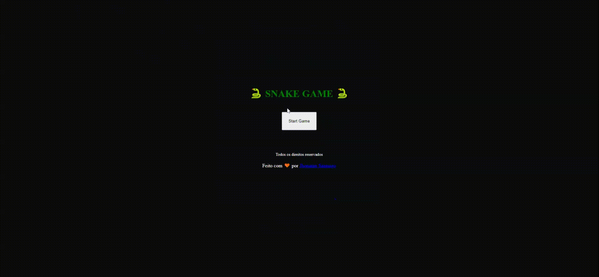

# Snake Game 
## Jogue aqui [Snake Game](https://snakegamebyjhss.vercel.app/) 

Jogo recriado por mim, tendo usado como código base do projeto do Curso da Digital Innovation One - Recriando o jogo da cobrinha com JavaScript
Disponível nesse link [[JhonatanSSantiago](https://github.com/JhonatanSSantiago)/**[curso-dio-jogo-cobrinha](https://github.com/JhonatanSSantiago/curso-dio-jogo-cobrinha)**]

Nessa nova versão adicionei:
	Pontuação do usuário.
	Tela de Start Game.
	Tela de Game Over.
	Limite de colisão com a parede da tela.
	
pretendo ir adicionando mais funcionalidades no futuro

Linguagem e Tecnologias usadas:
	HTML
	CSS
	JavaScript
	jQuery

